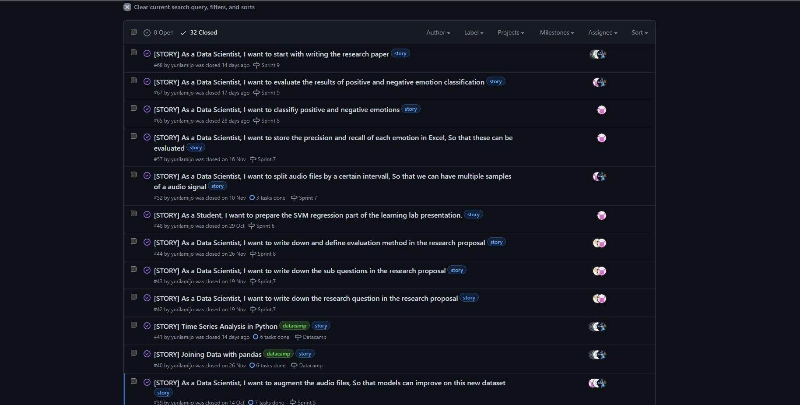

# Portfolio Zahir Bholai 19126778 Applied Data Science
Docenten: Tony Andrioli, Raymond Hoogendoorn, Ruud Vermeij and Jeroen Vuurens

## Introduction
Dit is de portfolio van een bestuurskundestudent die de minor Applied Data Science gevolgd heeft. Een uitdagende en leuke minor voor iedereen die geïnteresseerd is in de wereld van data science.

## Datacamp Courses

## Reflection and evaluation

### Reflection on own contribution to the project.
#### Situation

De Smart Teddy Project was het eerste data science project waarin ik aan deelgenomen heb. Ik heb positieve herinneringen over het project. Vanaf dag 1 waren we begonnen met het project door de communicatiekanaal te bepalen en te kijken hoe we het project bij gaan houden.  Aangezien ik een bestuurskundestudent ben, was ik bezorgd of ik wel een bijdrage voor het project zou kunnen leveren. Ik had in het begin vooral momenten in de minor waar ik aan mezelf begon te twijfelen of ik op de goede plek zat. Echter door gemotiveerd te blijven, vragen te stellen en de wil om te leren heb ik ervoor gezorgd dat ik een bijdrage aan het project heb geleverd.

#### Task

Één van de uitdagende bijdrage waaraan ik gewerkt heb was het classificeren en evalueren van positieve en negatieve emoties voor de machine learning modellen en CNN model. Allereerst moest ik de emoties uitgedrukt in spraakaudio in positief, neutraal en negatief classificeren. Vervolgens moest ik de classificatie in de machine learning modellen runnen. Nadat het gerund was moest ik de resultaten van de classificatie evalueren. De bijdragen die ik gemaakt heb waren in het begin op het onderzoekende deel van het project gericht. In de loop van de minor leerde ik programmeren waardoor ik ook wat bijdragen aan de technische deel van het project geleverd heb.

#### Action

Door vragen te stellen bij de daily stand-ups en mijn scherm te delen als ik ergens tegenaan liep. Websites als StackOverflow en TowardsDatascience waren ook nuttig om informatie te krijgen over de bijdragen waaraan ik gewerkt heb.

#### Result

Ik ben tevreden over de resultaten die we geboekt hebben. De projectleden waren behulpzaam tegen elkaar. Als iemand tegen iets aanliep, sprong een projectlid erbij om degene te helpen. De uitdagende bijdrage waaraan ik gewerkt heb is met goed gevolg afgesloten.

#### Reflection

De les dat ik geleerd heb is om altijd transparant te over de progressie die je geboekt heb. Vier projectleden studeren software engineering en hebben meer ervaring op het gebied van computerwetenschappen dan ik. Daarbij ben ik ervan bewust dat mijn programmeervaardigheden niet zo sterk zijn als de vier projectleden die software engineering studeren. Op sommige momenten liep ik vast en moest ik om hulp vragen. Door mijn scherm te delen en nuttige feedback te ontvangen heb ik ervoor gezorgd om mijn bijdrage tot een goed einde te brengen. Transparantie over je werkzaamheden was een sleutelfactor om je bijdrage aan het project tot een succes te maken.

### Reflection on own learning objectives.
#### Situation

Er was een reden waarom ik, een bestuurskundestudent voor deze minor gekozen had. Ik wilde de wereld van data science verkennen zodat ik de hulpmiddelen en methoden van de minor later in mijn carrière in de publieke sector kan toepassen. Ik had daarbij voor mezelf leerdoelen gesteld. Deze leerdoelen wilde ik aan de eind van de minor kunnen beheersen.

#### Task

De leerdoelen die ik voor mezelf gesteld had zijn de volgende:

1.	Ik wil de basis van python leren
2.	Ik wil leren hoe je een werkende machine learning model op een dataset kan toepassen
3.	Ik wil mijn onderzoeksvaardigheden uitbreiden door meer te leren over visualisatie
4.	Ik wil leren hoe je een werkende neuraal netwerk model op een dataset kan toepassen.

#### Action

Om de gestelde leerdoelen te behalen heb ik het volgende gedaan:

Als een bestuurskundestudent had ik geen kennis over programmeertalen. Ik was vastberaden om aan het begin van de minor de basis van python te leren. Het was immers de programmeertaal die de minor hanteerde.

Over machine learning modellen en hoe je het kan implementeren heb ik voornamelijk uit de courses van DataCamp en de hoorcolleges van Jeroen Vuurens geleerd.

Ik wilde mijn onderzoeksvaardigheden uitbreiden door meer te leren over het visualiseren van data. De workshop van Tony Andioli over datavisualisatie waren op dit punt behulpzaam. De do’s en don’ts van het visualiseren van data waren nuttig en is iets wat ik zeker nog in de toekomst baat bij zal hebben.

Over neurale netwerken en hoe je het kan implementeren heb ik voornamelijk geleerd uit de hoorcolleges van Jeroen Vuurens en informatie van internet.

#### Result

Ik heb alles gedaan om mijn leerdoelen tot een succes te brengen. 
Het gevolg is dat ik de gestelde leerdoelen behaald heb. 

Voor het leren van de basis van python heb ik de DataCamp cursussen 100% voltooid. 

Voor het implementeren van een machine learning model op een dataset heb ik verschillende machine learning modellen zoals een SVM, lineaire regressie model en een decisiontreeclassifier op diverse datasets van sklearn en Kaggle toegepast. 

Voor het uitbreiden van mijn onderzoeksvaardigeden door te leren over visualisatie heb ik geleerd over de python package matplotlib.pyplot. Matplotlib.pyplot is een handige hulpmiddel om visualisaties van data te maken en is daarbij zeker een onderdeel wat ik voor het vervolg van mijn studieloopbaan en toekomstige carrière ga gebruiken. 

Voor het implementeren van een werkende neuraal netwerk op een dataset heb ik eerst een feed forward neural network en daarna een convolutional neural network op de MNIST dataset toegepast.

#### Reflection

Ik ben tevreden met de resultaten die ik in korte tijd geboekt heb. Ik kwam naar deze minor met nul kennis over python, machine learning modellen, neurale netwerken en data visualisatie technieken. Gedurende minor heb ik alles gegeven om mijn leerdoelen te voltooien. Ik ben tot de realisatie gekomen dat ik niet klaar ben met leren. Ik zal mijn data science skills door blijven trainen door meer te leren.   

### Evaluation on the group project as a whole.
#### Situation

De projectgroep waar ik deel van uitmaakte had in totaal zes projectleden. Vier projectleden studeren software engineering en één projectlid studeert bedrijfskunde. We zijn allemaal studenten die een minor moeten afronden om de afstudeerfase van de opleiding te betreden. 

#### Task

Elk projectlid was gemotiveerd om de minor te voltooien. Vanaf dag 1 waren we begonnen met de planning van het project. Communicatie tussen de projectleden verliep goed. Vanaf dag 1 hadden we de communicatiekanaal vastgesteld die we als communicatiemiddel zouden gebruiken. Een projectlid is tevens leraar bij De Haagse Hogeschool. Hij zorgde ervoor dat lokalen gereserveerd waren zodat we de meetings met docenten konden houden. Tijdens de meetings met docenten zorgde ik ervoor dat er notities van de belangrijke punten gemaakt werden. Een ander student was de scrum master van de het project. Hij hield het overzicht van het project en organiseerde de daily stand-ups, wekelijkse refinements en tweewekelijkse retrospectives aan het eind van de sprint. Iedereen had zicht op het werk van een ander doordat de bijdragen van het project in zogeheten user stories op GitHub genoteerd waren.

#### Action

Op sommige momenten waren we allemaal gefocust op één onderdeel. Bijvoorbeeld het literatuuronderzoek. In het begin van het project hebben we diverse papers gelezen en besproken om domeinkennis op te doen. 

Op andere momenten waren we zelfstandig aan het werk aan onze bijdragen. De research proposal die ik en projectlid Breno geschreven hebben is daar een voorbeeld van. 
Ook deden we aan pair programming. Ik en projectlid Jaap gingen bijvoorbeeld samen een logistic regression model trainen en evalueren. 

We waren allemaal vastberaden om het project tot een goed einde te brengen. Zodra we tegenslagen tegemoet kwamen, gingen we het op school bespreken om tot een oplossing te komen. De docenten waren ook bereid om te helpen wanneer we tegenslagen tegemoet kwamen.

#### Result

Ik ben tevreden met resultaat die we geboekt hebben. De projectgroep waren van begin tot eind gemotiveerd om het project tot een goed einde te brengen. Dit is te merken in het eindresultaat van het project.

#### Reflection

Ik heb met plezier aan mijn eerste data science project gewerkt. Dit komt mede door de positieve ervaringen dat ik in de groep heb meegemaakt. Iedereen heeft gedaan wat hij moest doen en was transparant daarin door het te vermelden in de daily stand-ups. Na de sprint hadden we een moment genaamd de retrospective waarbij we de goede aspecten, minder goede aspecten en actiepunten van de sprint bespraken. Deze structuur van werken beviel mij.
  
## Research Project

### Task Definition
De Smart Teddy is een therapeutische metgezel met basisfunctionaliteiten. Het kan geluid maken en bewegen als iemand hem aanraakt. Het is zacht en schattig zodat mensen het vast kunnen pakken en  kunnen knuffelen. Senioren kunnen de Smart Teddy op lange termijn gebruiken. Net als een huisdier observeert de Smart Teddy  senioren. Dit wordt gedaan d.m.v. sensoren. Het heeft een digitale brein dat ervoor zorgt dat de Smart Teddy de senior gedurende dag begrijpt. Op basis hiervan maakt het een schatting over de tijd waarin de senior gelukkig is. De Smart Teddy kan ook controleren of de senior genoeg slaap krijgt en wanneer de senior in de nacht wakker wordt. Van deze informatie maakt de Smart Teddy een weloverwogen schatting over de kwaliteit van het leven van de senior. Dit wordt gebruikt om familie en verzorgers te informeren. De Smart Teddy wordt gebruikt voor senioren die kampen met dementie.

De Smart Teddy Project was gesplitst in drie groepen in de minor. Een groep werkte aan het detecteren van eet- en drinkgeluiden. Een ander groep werkte aan het detecteren van dialoog in de kamer. Ons projectgroep werkte aan het detecteren van emoties. De einddoel van ons project was het detecteren en classificeren van emoties. De Smart Teddy Project werd geleid door dr. Hani Al-Ers. 

De groep is tot de volgende hoofdvraag gekomen:

*Which machine learning models achieve the highest precision classifying emotions, using datasets containing audio with labeled vocal emotional expressions recorded in a professional recording studio, in order to recognize emotions within household environments?*

De machine learning models in de hoofdvraag is niet meer van toepassing aangezien de research paper alleen de focus legt op de convolutional neural network en niet op de machine learning modellen die gebouwd zijn.

Meer informatie over de richting van het onderzoek zal in de sub-paragraaf research proposal behandeld worden.

#### Research proposal
De research proposal was geschreven door mezelf en projectlid Breno. We hebben de research proposal geschreven om een duidelijke richting over het onderzoek te geven. Daarnaast heeft de research proposal geholpen bij het schrijven van de paper. De reden dat de hoofdvraag gekozen is, omdat de projectgroep de huidige methoden van het classificeren van audio data aan het onderzoeken was. Er is gekozen om op precision te focussen. Het eindgebruik gaat over het peilen van de mentale gezondheid van senioren. Dit moet accuraat behandeld worden. Het is onacceptabel om veel valse positieven te hebben aangezien de teddybeer als een adviseur voor zorgverleners gebruikt gaat worden. Het is beter om zeker te zijn dat een emotie correct gedetecteerd wordt dan een emotie te misclassificeren. De emoties die gedetecteerd worden zijn een indicatie over de gezondheid van een senior en of de senior daarbij in staat is zelfstandig te leven. Er is besloten om huishoudelijke omgevingsgeluiden aan de datasets toe te voegen om realistische scenarios na te bootsen. 

De scope van het onderzoek, deelvragen en gerelateerde werk zijn ook in de 
[research proposal](https://docs.google.com/document/d/1NxFVP1G9DyZr4Q7_GdJvULewCiscxtOvygtyHUCDSeE/edit#heading=h.rqlgrsn8oj5p) behandeld.

#### Notes
Elke week had de projectgroep meetings met docenten en de producteigenaar. Nieuwe ideeën en feedback zijn onderwerpen dat tijdens de meetings naar voren kwamen. Bij deze meetings functioneerde ik als notulist waarbij ik notities maakte van de belangrijke punten dat er tijdens de meetings besproken werden. De [notities](https://docs.google.com/document/d/1xQncillbnLcRF8wKagUnnbbejlcOvx4zWCJvwhQ0PGc/edit#) zijn hier.

### Evaluation

In de toekomst kan het onderzoek op verschillende manieren verder opgepakt worden. 

Allereerst kan het aantal neutrale samples in de dataset vergroot worden om te kijken of de precision van de neutrale emotie verbeterd wordt. Een gevolg hiervan is dat de datasets niet in balans is, maar er is een kans dat de precision van emoties angry, happy en sad verbeterd worden.
Daarnaast kan er naast de vier gebruikte datasets meerdere datasets toegevoegd worden om te kijken of het impact op de precision heeft. De datasets dat toegevoegd kunnen worden zijn: eNTERFACE, EMO-DB, DES en SUSAS. 
Wanneer er real world data beschikbaar is, kan er getest worden om langere samples. 
Emoties zijn vaak uitgedrukt in meerdere zinnen. 
Hyperparameter tuning is daarbij ook een onderdeel dat opgepakt kan worden voor de convolutional neural network. De learning rate en batchsize zijn de parameters die getuned kan worden.
Tot slot kan er in de positieve, negatieve en neutrale groepen emoties toegevoegd of verwijderd worden. Hiermee te experimenteren kan de precision van de model wellicht verbeterd worden.

### Conclusions

Om de hoofdvraag te beantwoorden zijn er vier datasets gebruikt met gelabelde audio samples van acteurs die diverse emoties uitspreken. De datasets zijn: RAVDESS, CREMA-D, SAVEE en TESS. Deze vier datasets zijn samengevoegd. Er werd zodoende een dataset met veel samples gemaakt die aan de convolutional neural network gegeven werd. De precision van de CNN zonder huishoudelijke omgevingsgeluiden is 87%. De precision van de CNN met huishoudelijke omgevingsgeluiden is 84%. Er kan geconcludeerd worden dat de huishoudelijke omgevingsgeluiden een lichte negatieve impact op de convolutional neural network heeft. 

### Planning
De planning van het project was onder handen genomen door projectlid/scrummaster Yuri. Hij was de persoon die de planning bewaakte. Daarbij zorgde hij ook voor de interne meetings om samen met de projectgroep naar de planning te kijken om stappen in het project te maken.

#### GitHub
GitHub was de website waar het project beheert werd. De repository was opgezet door projectlid Koen. Elk projectlid had via GitHub inzicht in de werkzaamheden van het project. De taken van het project werd verdeeld in zogeheten User Stories. Elk projectlid heeft een bijdrage aan het project geleverd door zijn toegewezen User Stories te voltooien.

De Scrumboard van het project:

De User Stories dat aan mij in chronologische volgorde toegewezen zijn:

#### Sprint
De projectgroep werkte in het begin van het project in wekelijkse sprint. In de loop van het project is de projectgroep overgegaan naar tweewekelijkse sprint, omdat de User Stories van het project breder en complexer werd.

#### Daily Stand-ups
Iedere dag werd er een daily stand-up gehouden. In de daily-stand-up werd er besproken wat ieder projectlid de vorige dag gedaan heeft, waar hij eventueel tegenaan gelopen is en wat er op de huidige dag gedaan gaat worden. De daily-stand-up gaf zodoende inzicht in de werkzaamheden van een projectlid.

#### Refinement
In de tweewekelijkse sprint werd er na de eerste week een refinement gehouden. In de refinement werd er de roadmap gebruikt die door de scrummaster en projectlid Koen opgezet zijn. De roadmap is gemaakt in Miro. De roadmap gaf inzicht in hoe we ervoor staan. De projectgroep kreeg daarnaast inzicht of de projectwerkzaamheden op de juiste tempo gedaan werd. In de refinement werd er door de projectgroep besproken of er iets aan de roadmap aangepast moest worden. 

De roadmap:

#### Retrospective
De retrospective werd aan het eind van een sprint gehouden. De retrospective werd georganiseerd door de scrummaster via Fraankly.  In de retrospective kreeg ieder projectlid de mogelijkheid om de goede aspecten, minder goede aspecten en veranderpunten voor de volgende sprint op te schrijven. Zodra ieder projectlid zijn deel opgeschreven had, werd er door ieder projectlid een korte presentatie gegeven over de onderdelen die hij opgeschreven had. Na de presentaties vond er een stemronde plaats over de onderdelen die ieder projectlid het belangrijkst acht. Na de stemronde werd er een lijst met actiepunten gemaakt die voor de volgende sprint meegenomen werd.

De retrospective die in sprint 6 gehouden werd:

## Predictive Analytics

### Selecting a Model
De machine learning modellen die de projectgroep gebouwd hebben zijn: SVM, logistic regression, multi-layered perceptron en een KNN model. Ik en projectlid Jaap hebben gewerkt aan een logistic regression model. De projectgroep had geen toegang tot real world data. Voor het project hebben we gebruikt gemaakt van datasets die audio data bevat van verschillende emoties die in spraak uitgedrukt zijn. We hebben voor dit model gekozen, omdat we een [paper](https://ieeexplore-ieee-org.ezproxy.hhs.nl/stamp/stamp.jsp?tp=&arnumber=9249147) tegenkwamen die bij een soortgelijk onderzoek een logistic regression gebruikt heeft. Het onderzoek heeft de RAVDESS dataset gebruikt. Wij hebben er voor gekozen om de RAVDESS en CREMA-D datasets te gebruiken.

### Configuring a Model
Voor de configuratie van de logistic regression model hebben we alle hyperparameters gebruikt die we konden [vinden](https://scikit-learn.org/stable/modules/generated/sklearn.linear_model.LogisticRegression.html). 
    
    class LogisticalRegression(BaseModel):
    instance = "Logistical Regression"
    
    @classmethod
    def grid_search(self,model,x_train, x_test, y_train, y_test,scoring):
        
        solvers = ['newton-cg', 'lbfgs', 'liblinear', 'sag', 'saga']
        penalty = ['none', 'l1','l2','elasticnet']
        param_grid = dict(solver=solvers,penalty=penalty,C=c_values)
            
       

### Training a model

Om te voorkomen dat het model over- of underfit, hebben we gebruikt gemaakt van GridSearchCV. GridSearchCV zoekt de beste parameters voor je uit om je model te trainen. Dit is de reden waarom we alle hyperparameters in ons model gezet hebben.

        start_time = time.perf_counter()
        clf = GridSearchCV(model, param_grid, cv=5, scoring=scoring, n_jobs=5) 
        end_time = time.perf_counter()
        print(f"Duration Gridsearch: {end_time - start_time:04f}")
        
        start_time = time.perf_counter()
        clf.fit(x_train, y_train)
        end_time = time.perf_counter()
        
        print(f"Duration fitting: {end_time - start_time:04f}")
        print()
        
        print("Best parameters set found on development set:")
        print(clf.best_params_)
        print(clf.best_estimator_)

        super().model_accuracy(clf, x_train, x_test, y_train, y_test)
        
Ik heb gespeeld met de cv parameter om te zien of er bij diverse variabelen in de test en train accuracy verschil is. Wat er opvalt is dat bij een even variabele de test en train accuracy lichtelijk beter scoort dan bij een oneven variabele.

| cv | Train CREMA-D | Test CREMA-D | Train RAVDESS  | Test RAVDESS | 
| ------------- | ------------- | ------------- | ------------- | ------------- |
| 3 | 0,55|0,52|0,67|0,63|
| 4 | 0,55  | 0,52 | 0,71  | 0,63  |
| 5 | 0,55 | 0,52 | 0,67 |0,63 |
| 6  | 0.55|0,52|0,72|0,63|

### Evaluating a model

De logistic regression model is geëvalueerd met de machine learning modellen die de projectleden gemaakt hebben. De evaluatie van de modellen is [hier](https://docs.google.com/spreadsheets/d/1SGjHORuv2V7R-UGH_zaVUPe-bFol-A4_j-msHxtJBgM/edit#gid=0) te vinden.

### Visualizing the outcome of a model (explanatory)

De uitkomsten van machine learning modellen waaronder de logistic regression models zijn gevisualiseerd in confusion matrices. De reden dat confusion matrices zijn gekozen, is omdat de [paper]((https://ieeexplore-ieee-org.ezproxy.hhs.nl/stamp/stamp.jsp?tp=&arnumber=9249147)) die gebruikt was als hulpmiddel ook gebruik maakte van confusion matrices. Daarnaast is confusion matrices handig voor het visualiseren van machine learning modellen die een classificatie (van emoties in dit geval) uitvoeren.

De confusion matrix van de logistic regression model:

## Domain knowledge

Voor elk onderzoek heb je domeinkennis nodig voordat je stappen in het project kan maken. Meetings met de product owner heeft geholpen om een betere beeld van het project te creëren. Daarnaast had de projectgroep in de beginfase van het project literatuuronderzoek verricht om meer domeinkennis op te bouwen.

### Introduction of the subject field

De Smart Teddy is een project onder leiding van Dr. Hani al-Ers van De Haagse Hogeschool. De Smart Teddy is een teddybeer die als een therapeutisch metgezel fungeert. De doelgroep van de Smart Teddy is senioren die in de beginfase van dementie zitten. 

De Smart Teddy heeft een aantal functionaliteiten. De Smart Teddy observeert de senioren door gebruik te maken van sensoren. Het beschikt over een digitale brein dat kan begrijpen wat de senior gedurende dag aan het doen is. Daarnaast kan de Smart Teddy het slaappatroon inclusief momenten wanneer de senior wakker wordt monitoren. Op basis van deze informatie maakt de Smart Teddy een schatting over de levenskwaliteit van de senior. Informatie afkomstig van de Smart Teddy wordt aan de verzorgers en familieleden gedeeld. Tot slot kan de Smart Teddy gevaar herkennen. Denk hierbij aan rook, harde geluiden en noodkreten van de senior. Mocht er een moment zijn wanneer de Smart Teddy denkt dat de senior hulp nodig heeft, dan zal de Smart Teddy ervoor zorgen dat de senior hulp krijgt door een verzorger te alarmeren. 

De taak van de projectgroep was het detecteren en classificeren van emoties. De projectgroep had wegens privacyredenen geen toegang tot echte geluidsdata van senioren. Met instemming van Dr. Hani al-Ers heeft de projectgroep bestaande datasets van acteurs die emoties uitspreken gebruikt. Het detecteren en classificeren van emoties gaat een indicatie geven over de mentale gezondheid van de senior. Wanneer de Smart Teddy een periode geen emoties detecteert, kan het een indicatie zijn dat de mentale gezondheid van de senior achteruitgaat.

### Literature research

### Explanation of Terminology, jargon and definitions

## Data preprocessing

### Data exploration
 
### Data cleansing

### Data preparation

### Data explanation

### Data visualization (exploratory)

## Communications

### Presentations
De interne presentaties nam projectlid Jaap voor rekening. Bij de externe presentaties werd er in de groep besproken wie het zou willen presenteren. Ik vond het presenteren van de externe presentaties wel leuk, dus vandaar dat ik bij alle presentaties een deel gepresenteerd heb. Daarnaast heb ik ook een deel van de learning lab gepresenteerd.

[Externe presentatie 1](https://docs.google.com/presentation/d/120BFmn1kBqO9vJkrTBqgGG3YLxwpwIQ5/edit)

[Externe presentatie 2](https://docs.google.com/presentation/d/1Q8pCSaHh-NOdmONjhDi91h5KIwgagx26fTpmsYayNGw/edit)

[Externe presentatie 3](https://docs.google.com/presentation/d/1zTva9BPbiWAARs8vM3S7Wy0qXT1pBUMSoa-8i74HjZQ/edit)

[Learning lab](https://docs.google.com/presentation/d/1NrmkkP36NY3_dqtBgHQRZkpA7xsUlrhc/edit?rtpof=true)

### Writing paper
Ik en projectleden Yuri, Breno en Jaap waren gestart met het schrijven van de paper. Ik heb een bijdrage geleverd aan een deel van de Introduction, Background, Evaluation Method, en Future Work van de paper. Projectleden Koen en Julian sloten na hun werkzaamheden aan. De projectgroep had besloten om de paper alinea voor alinea van de paper te behandelen.  

## List of Notebooks 

